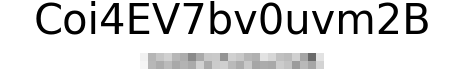

# Depixelation Tool

## Description
A machine learning tool designed to recognize text from heavily pixelated images.
This tool generates datasets of pixelated images, trains a neural network model to recognize the strings,
and provides benchmarking capabilities to evaluate the model's performance.

The model is built using Pytorch, leveraging convolutional neural networks (CNNs) and long short-term memory networks (LSTM)
with connectionist temporal classification (CTC) loss for sequence prediction. Inputs are converted to monochrome.

## Setup & usage
- Ensure Python is installed. Software was tested on version 3.12.1.
- Launch `setup.py` to install requirements in venv.
- Start `launcher.py` after setup is done.

### Dataset generation
- Edit `synthesizer/data_synth.py` to specify the configuration.
- Generate a dataset of pixelated images by running `launch.py` and choosing the "Synthesize images" option.

### Training a model
- Edit `config.json` to specify the configuration.
- Run `launcher.py` and choose the "Train model" option.

### Benchmarking a model
- Edit `config.json` to specify the configuration.
- Run `launcher.py` and choose the "Benchmark model" option.

### Inference
- Edit `config.json` and specify `model_name`.
- Create a white image sized 64 x 8 px, add pixelated area in the top-left corner.
- Make sure each block forming the mosaic is only one pixel large.
- If downscaling is required, use the "nearest neighbour" algorithm. 
- Drop the image in the `inference_input` folder.
- Run `launcher.py` and choose the "Run inference" option.

See example of a correctly prepared image in `sources/example_input.png` 

Can you crack the example image? Hint: Capital letters, 24pt Arial, block size 8 pixels.

### Downloading weights
Already trained models can be downloaded from the releases tab.
Each model is in a zip file, which needs to be extracted in the `models` folder.
Model metadata, benchmark results and training logs are included.

### Licensing

This project is licensed under the [MIT license](LICENSE).

