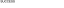

# Depixelation Tool

## Description
A machine learning tool designed to recognize text from heavily pixelated images.
This tool generates datasets of pixelated images, trains a neural network model to recognize the strings,
and provides benchmarking capabilities to evaluate the model's performance.

The model is built using Pytorch, leveraging convolutional neural networks (CNNs) and long short-term memory networks (LSTM)
with connectionist temporal classification (CTC) loss for sequence prediction. Inputs are converted to monochrome.

Some example models are provided, but they are relatively narrow. Training custom models for your situation is recommended for best results.

## Setup & usage
- Ensure Python is installed. Software was tested on version 3.12.1.
- Launch `setup.py` to install requirements in venv. Pytorch and other libraries may need 6GB.
- Start `launcher.py` after setup is done.

### Dataset generation
- Edit `synthesizer/data_synth.py` to specify the configuration.
- Generate a dataset of pixelated images by running `launch.py` and choosing the "Synthesize images" option.

### Training a model
- Edit `config.json` to specify the configuration.
- Run `launcher.py` and choose the "Train model" option.

### Benchmarking a model
- Edit `config.json` to specify the configuration.
- Run `launcher.py` and choose the "Benchmark model" option.

### Inference
- Edit `config.json` and specify the configuration.
- Create a white image sized 64 x 8 px (if using 8px block size), add pixelated area in the top-left corner.
- If using 16px block size, then the image should be half the size: 32 x 4 px, etc.
- Make sure each block forming the mosaic is only one pixel large.
- If downscaling is required, use the "nearest neighbour" algorithm. 
- Drop the image in the `inference_input` folder.
- Run `launcher.py` and choose the "Run inference" option.

See example of a correctly prepared image in `sources/example_input.png` 

Can you crack the example image? Hint: Capital letters, 24pt Arial, block size 8 pixels.

### Downloading weights
Some already trained models can be downloaded here:

[Numbers Arial 22-28pt 8px](https://pov.ee/link/weights/numbers.zip)

[Capital letters Arial 22-28pt 8px](https://pov.ee/link/weights/capital_letters.zip)

[Alphanumeric Arial & Times New Roman 20-28pt 8px](https://pov.ee/link/weights/arial_times_general_20-28pt_8px.zip)

[Classifier (Numbers/Capital letters) Arial 24-28pt 16px](https://pov.ee/link/weights/uppercase_vs_numbers_classifier_24-28pt_16px.zip)

Each model is in a zip file, which needs to be extracted in the `models` folder.
Model metadata, benchmark results and training logs are included.

### Classification

Results may be improved by determining details about the input image and choosing a specialized model instead of a broad generalizer.
For example an image may be classified by character set, font, font size, block size, pixelation algorithm, color or text rendering engine.
Provided code demonstrates dividing images into two classes: uppercase letters and numbers.
There are multiple ways to automate character set classification of images, a simple provided implementation just trains on pairs of images and classes (index numbers).
It is also possible to implement classification by determining class by inspecting model output and choosing the most common type among output characters.

Classification could yield decent results if classifiers are combined into a decision tree.
Using both generalizers and classifiers can create a MoE system, where the best models are chosen.
These models can then reach a consensus on the best output string by combining their output matrices.

## Licensing

This project is licensed under the [MIT license](LICENSE).

